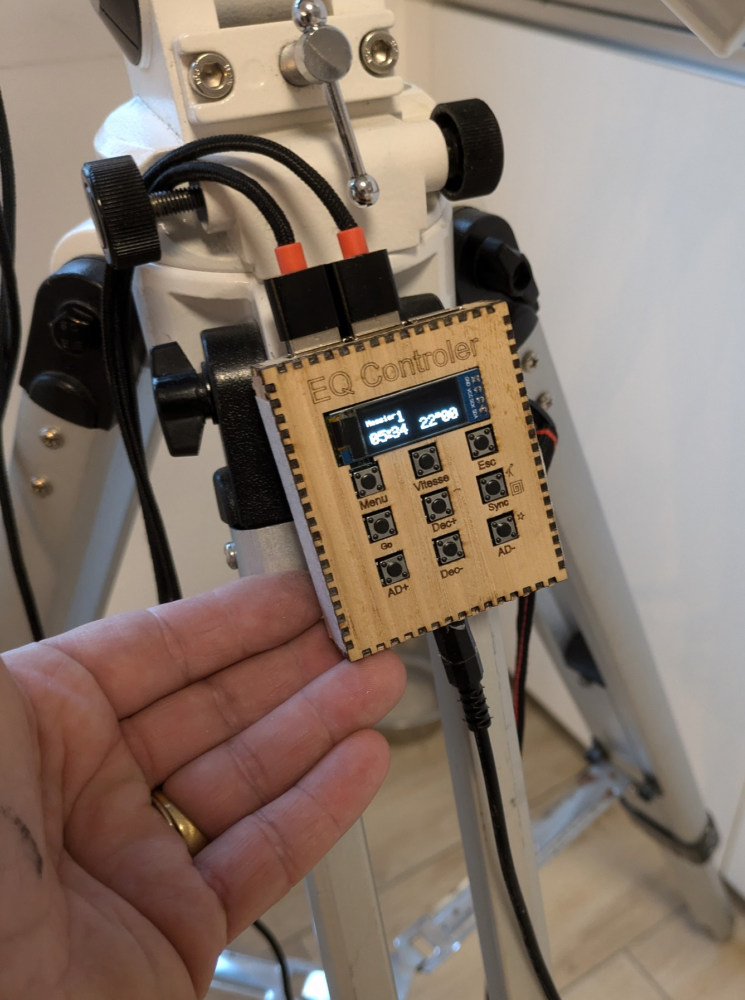
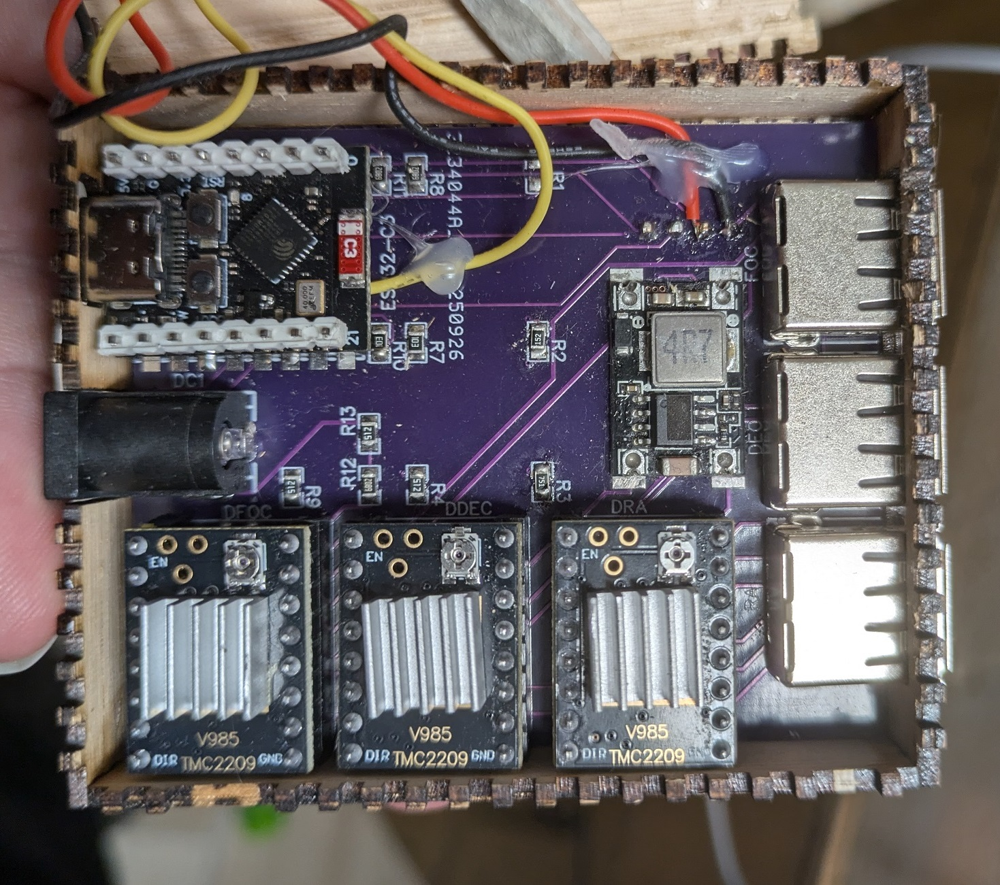
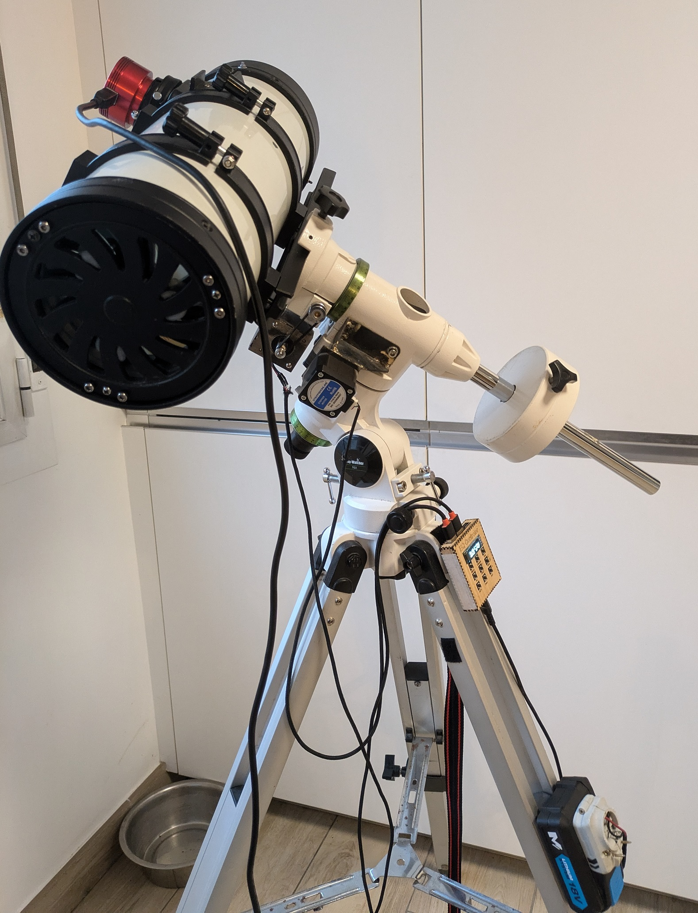
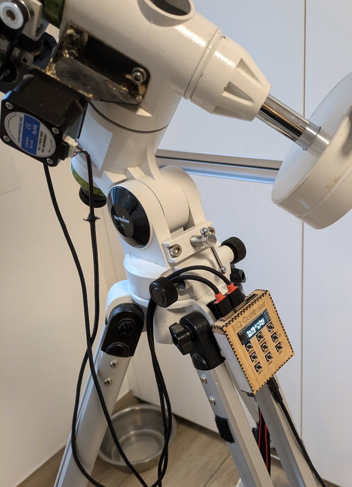
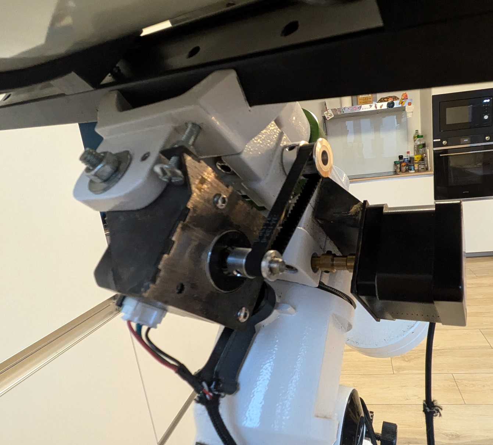
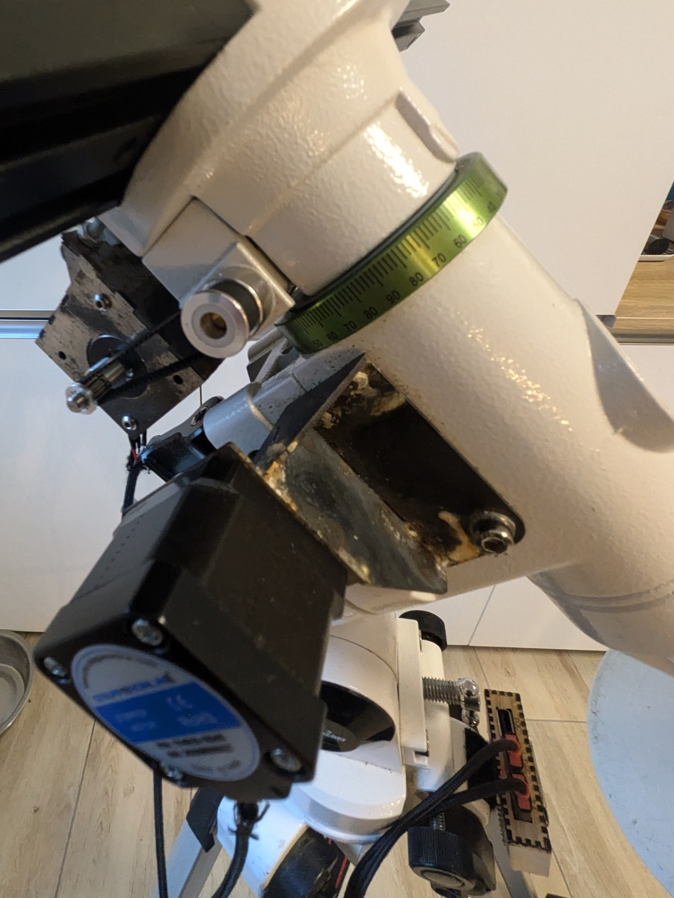

# eq_control

Eq control is an esp32/arduino based equatorial telescop mount controler system.
This also has an additional focuser controler (or rotator if you want, but focus is the most useful)

This system was originally designed for an EQ3, but has been sucessfully used on EQ5 and other az mounts.

It consist of a CPU that can control 3 stepper motors for RA, Dec and focus, a LCD and a keyboard.

It can be used "in hand" as an offline controler.
It can be connected to a computer with Ascom or Alpaca for more complex astro (like astro photography).
The controler is a 6*7*1.7cm box which does everything!

# Brief history

This project started on arduino Nano. This was never released at large, but I have given a number of boards to various persons and I still own a number of them. As a result I need to continue supporting them.

Hence the code here continues support for these old boards which you will find in Firmware\eqControl_Ino

# Directory structure, Aka: Where to find stuff
## Software

If using esp32, you will open the Firmware directory using visual studio code and esp-idf. This uses the same .ino code as a #include!

in the Firmware\windows directory you will find a windows solution that uses once again the same code and can be used for debugging.

the Ascom directory contains the Ascom driver for the system (need visual studio and ascom tools installed)

## Hardware
HW project can be found here:  https://oshwlab.com/cyrille.de.brebisson/sheet_copy_copy_copy_copy_copy_copy_copy_copy

The Hwardware and mechanicals directory has the Gerber and schematics.
I still need to put the files for making the laser cut box

# Licence
All content of this repository is copyright Cyrille de Brébisson
Contact me if you want to use all or part of it.
Most likely I will say yes unless it is for commercial use at which point... we can discuss
